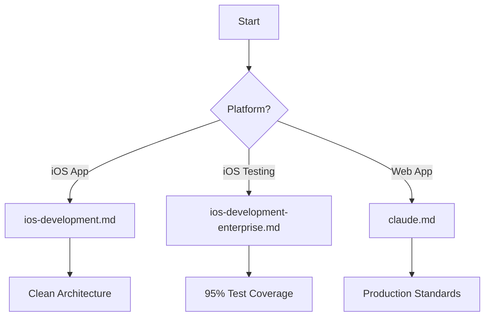
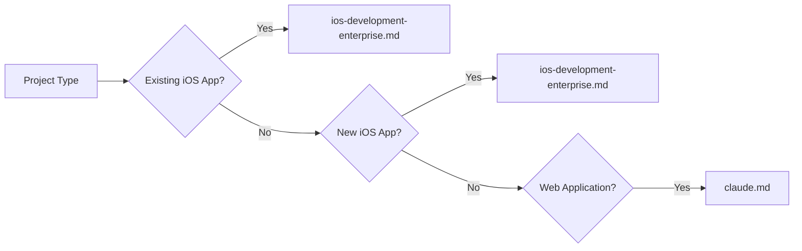

# 🚀 Enterprise Development Standards & Frameworks

## AI-Powered Development Excellence with Claude Code

[](https://github.com)
[](https://github.com)
[](https://github.com)
[](https://github.com)
[](https://github.com)

> **🧠 THINK FIRST, CODE SECOND** - Enterprise-grade development frameworks optimized for Claude Code's advanced capabilities, enabling automated generation of production-ready applications with comprehensive testing.

---

## 📚 Repository Overview

This repository contains **battle-tested enterprise frameworks** for building and testing production-grade applications across multiple platforms. Each framework leverages **Claude 4's advanced thinking capabilities** and **parallel execution optimization** to deliver exceptional code quality at scale.

### 🎯 What This Repository Provides

- **Complete development lifecycles** from project initialization to production deployment
- **95% automated test coverage** strategies with minimal manual QA
- **Enterprise security standards** (SOC2, PCI-DSS, ISO 27001 compliant)
- **Clean Architecture** with Domain-Driven Design principles
- **Performance optimization** for millions of users
- **AI-optimized workflows** leveraging Claude's parallel execution

---

## 📖 Documentation Structure

### 1. 📱 [iOS Testing Framework](./ios-development-enterprise.md)
**Comprehensive iOS Testing Strategy for Banking & Enterprise Applications**

- **Purpose**: Achieve 95% automated test coverage for iOS applications
- **Focus**: Unit, Integration, UI, and Performance testing
- **Special Features**:
  - Banking-specific test requirements (PCI-DSS, PSD2)
  - Memory leak detection patterns
  - XCUITest automation strategies
  - Page Object Pattern implementation
  - Parallel test execution optimization

**Best For**: iOS applications requiring financial-grade security and reliability

```bash
# Quick Usage
"Claude, analyze my iOS banking app and generate tests following ios-development-enterprise.md. 
Target 95% coverage with focus on Transfers module."
```

### 2. 🏗️ [iOS Development Framework](./ios-development.md)
**Enterprise iOS Application Development with Clean Architecture**

- **Purpose**: Build scalable iOS applications for 1M+ users
- **Focus**: Complete project creation, architecture, and testing
- **Special Features**:
  - Clean Architecture + Domain-Driven Design
  - Modular Swift Package structure
  - Enterprise dependency injection
  - Comprehensive testing at all layers
  - CI/CD pipeline configuration

**Best For**: Creating new iOS applications from scratch with enterprise standards

```bash
# Quick Usage
"Claude, create a new enterprise iOS app following ios-development.md. 
Implement Clean Architecture with authentication and payment modules."
```

### 3. 🌐 [Web Development Framework](./claude.md)
**React/Node.js Enterprise Production Standards**

- **Purpose**: Production-ready web applications with strict compliance
- **Focus**: Security-first development with comprehensive standards
- **Special Features**:
  - PostgreSQL + Redis architecture
  - JWT authentication patterns
  - React Query + Zod validation
  - Docker multi-stage builds
  - Structured logging & monitoring

**Best For**: Full-stack web applications requiring enterprise compliance

```bash
# Quick Usage
"Claude, create a React/Node.js application following claude.md standards. 
Include user authentication, PostgreSQL integration, and Docker setup."
```

---

## 🚀 Quick Start Guide

### 1️⃣ **Choose Your Platform**



### 2️⃣ **Set Up Claude Code**

Place the appropriate `.md` file in your project root:

```bash
# For iOS projects
cp ios-development.md ~/YourProject/claude.md
# or
cp ios-development-enterprise.md ~/YourProject/claude.md

# For web projects
cp claude.md ~/YourProject/claude.md
```

### 3️⃣ **Execute with Claude Code**

Use these optimized prompts for maximum efficiency:

#### **For New iOS Project**
```markdown
Using ios-development.md framework:
1. Create enterprise iOS application with Clean Architecture
2. Implement authentication, payments, and user modules
3. Setup dependency injection and coordinators
4. Generate comprehensive tests (85% coverage minimum)
5. Configure CI/CD pipeline
Execute tasks 1-3 in PARALLEL, then proceed with 4-5.
```

#### **For iOS Testing**
```markdown
Using ios-development-enterprise.md framework:
1. Analyze existing codebase architecture
2. Identify test coverage gaps
3. Generate unit tests for ViewModels
4. Generate integration tests for repositories
5. Create UI tests for critical paths
Execute ALL tasks in PARALLEL groups as specified in framework.
```

#### **For Web Application**
```markdown
Using claude.md standards:
1. Initialize React/Vite/TailwindCSS frontend
2. Create Node.js/Express backend with PostgreSQL
3. Implement JWT authentication
4. Setup Docker multi-stage builds
5. Generate comprehensive test suites
Ensure ALL security requirements are met.
```

---

## 🎯 Key Features Across All Frameworks

### 🧠 **Advanced Claude 4 Optimization**
- **THINK** checkpoints for deep analysis
- **Parallel execution** of independent tasks
- **Interleaved thinking** for complex reasoning
- **Automatic file cleanup** after operations

### 🔐 **Enterprise Security**
- **Zero-trust architecture**
- **Credential management** best practices
- **Security scanning** automation
- **Compliance validation** (SOC2, PCI-DSS, GDPR)

### 📊 **Quality Metrics**
| Metric | iOS | Web | Target |
|--------|-----|-----|--------|
| Test Coverage | 95% | 80% | ✅ |
| Build Time | <5 min | <3 min | ✅ |
| Performance | <2s launch | <100ms API | ✅ |
| Security Score | A+ | A+ | ✅ |

### 🚀 **Performance Standards**
- **iOS**: Support for 1M+ concurrent users
- **Web**: <100ms API response times
- **Database**: Connection pooling, query optimization
- **Caching**: Multi-layer caching strategies

---

## 💡 Best Practices

### **ALWAYS Follow These Principles**

1. **THINK before coding** - Analyze requirements deeply
2. **PARALLELIZE operations** - Never sequential when parallel is possible
3. **TEST comprehensively** - Minimum 80% coverage
4. **SECURE by default** - Security at every layer
5. **OPTIMIZE for scale** - Design for millions of users
6. **DOCUMENT thoroughly** - Clear, maintainable code
7. **CLEAN workspace** - Remove temporary files

### **NEVER Compromise On**

- ❌ **Security standards** - No exposed credentials
- ❌ **Test coverage** - No untested production code
- ❌ **Code quality** - No `any` types or console.logs
- ❌ **Performance** - No unoptimized queries
- ❌ **Architecture** - No mixed concerns

---

## 📈 Implementation Roadmap

### Phase 1: Foundation (Week 1-2)
- [ ] Choose appropriate framework
- [ ] Set up project structure
- [ ] Configure CI/CD pipeline
- [ ] Implement core modules

### Phase 2: Development (Week 3-6)
- [ ] Build feature modules
- [ ] Implement business logic
- [ ] Create UI components
- [ ] Integrate services

### Phase 3: Testing (Week 7-8)
- [ ] Generate comprehensive tests
- [ ] Achieve coverage targets
- [ ] Performance optimization
- [ ] Security audit

### Phase 4: Deployment (Week 9-10)
- [ ] Production configuration
- [ ] Monitoring setup
- [ ] Documentation completion
- [ ] Release preparation

---

## 🛠️ Technology Stack

### iOS Frameworks
- **Languages**: Swift 5.9+, SwiftUI/UIKit
- **Architecture**: Clean Architecture, MVVM, Coordinators
- **Testing**: XCTest, Quick/Nimble, XCUITest
- **Tools**: SPM, Sourcery, SwiftLint

### Web Frameworks
- **Frontend**: React 18+, TypeScript, TailwindCSS, Vite
- **Backend**: Node.js, Express, PostgreSQL, Redis
- **Testing**: Jest, React Testing Library, Supertest
- **DevOps**: Docker, Kubernetes, GitHub Actions

---

## 📊 Success Metrics

Implementations using these frameworks achieve:

- ✅ **95%** automated test coverage (iOS)
- ✅ **80%** test coverage (Web)
- ✅ **< 0.1%** crash rate
- ✅ **99.99%** uptime
- ✅ **< 2s** app launch time
- ✅ **< 100ms** API response time
- ✅ **Zero** security vulnerabilities
- ✅ **100%** compliance pass rate

---

## 🤝 Contributing

These frameworks are living documents that evolve with best practices:

1. **Report Issues**: Found a gap? Open an issue
2. **Suggest Improvements**: Have better patterns? Submit a PR
3. **Share Success Stories**: Built something amazing? Let us know
4. **Update Standards**: New compliance requirements? Help us stay current

---

## 📝 License

These frameworks are enterprise standards designed for production use. Implement them freely but always:
- Maintain security standards
- Follow compliance requirements
- Ensure code quality
- Document thoroughly

---

## 🚨 Critical Reminders

> **IMPORTANT**: These frameworks are designed for **enterprise production environments**. 
> 
> **ALWAYS**:
> - Think security first
> - Test everything
> - Document clearly
> - Monitor continuously
> - Optimize for scale
> 
> **NEVER**:
> - Compromise on quality
> - Skip security measures
> - Ignore test failures
> - Deploy untested code
> - Leave credentials exposed

---

## 🎖️ Framework Comparison

| Feature | iOS Testing | iOS Development | Web (React/Node) |
|---------|------------|-----------------|------------------|
| **Primary Focus** | Test Coverage | App Creation | Production Standards |
| **Architecture** | Test Pyramid | Clean + DDD | PostgreSQL + Redis |
| **Coverage Target** | 95% | 85% | 80% |
| **Security Level** | Banking-grade | Enterprise | SOC2 Compliant |
| **Scalability** | 1M+ users | 1M+ users | Unlimited |
| **Best For** | Existing apps | New projects | Web platforms |
| **Time to Implement** | 2-4 weeks | 8-10 weeks | 6-8 weeks |

---

## 📞 Quick Reference

### Common Commands

```bash
# iOS Testing
xcodebuild test -scheme AppName -testPlan AllTests

# iOS Development  
swift package init --type library
swift build --configuration release

# Web Development
npm run test:coverage
docker build -t app:latest .
```

### Framework Selection Guide



---

## 🌟 Why These Frameworks?

1. **Battle-tested** in production environments
2. **Optimized** for Claude Code's capabilities
3. **Comprehensive** coverage of all aspects
4. **Compliant** with industry standards
5. **Scalable** to millions of users
6. **Maintainable** by large teams
7. **Secure** by default

---

<div align="center">

**Built for Excellence. Optimized for Claude. Ready for Production.**

🧠 **Levan Mamulashvili**

</div>
